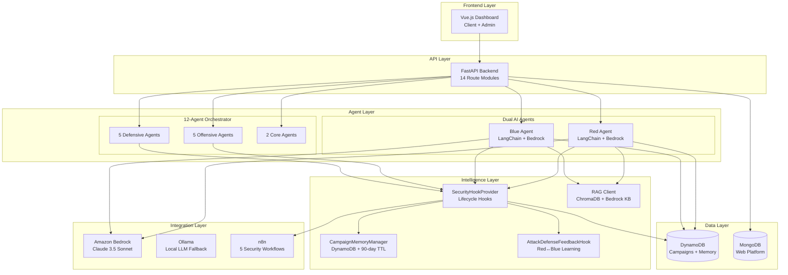
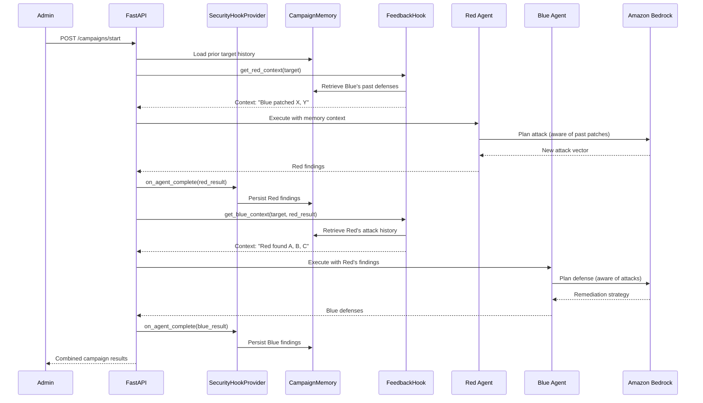
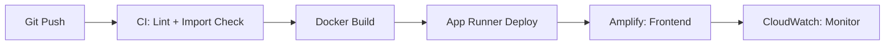
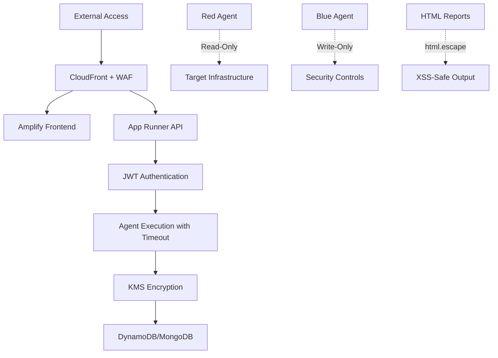

# Design Document: Sentinel AI
## Autonomous Purple Teaming Platform

**Project Name:** Sentinel AI  
**Tagline:** "Attack to Defend. Autonomously."  
**Version:** 2.0  
**Date:** March 16, 2026

---

## 1. Executive Summary

Sentinel AI is an autonomous purple teaming platform that deploys dual-model AI agents (Red Team offensive + Blue Team defensive) backed by a 12-agent orchestration system to validate vulnerabilities through active exploitation and auto-remediation. Built on AWS serverless architecture with lifecycle hooks, persistent campaign memory, and an attack-defense feedback loop.

### 1.1 Key Differentiators
- **Active Validation:** Unlike GuardDuty's passive monitoring, Sentinel AI actively exploits vulnerabilities to validate real risk.
- **Attack-Defense Feedback Loop:** Red Agent probes Blue's past defenses; Blue responds to Red's latest findings.
- **Persistent Campaign Memory:** DynamoDB-backed per-target memory with 90-day TTL enables cross-session learning.
- **Lifecycle Hooks:** Automatic context loading and result persistence for every agent execution.
- **14-Agent System:** 2 dual-model agents (Red/Blue) + 12 specialized orchestrator agents.
- **Full Web Platform:** Vue.js dashboard, admin panel, blog CMS, SEO, notifications, and 14 REST API routes.
- **Production-Hardened:** Async-safe agents, execution timeouts, NVD rate limiting, XSS-safe reports.
- **Dual LLM Support:** Amazon Bedrock (Claude 3.5 Sonnet) + Ollama (local fallback).

---

## 2. System Architecture

### 2.1 High-Level Architecture


```mermaid
graph TB
    subgraph "Frontend Layer"
        UI[Vue.js Dashboard<br/>Client + Admin]
    end
    
    subgraph "API Layer"
        FASTAPI[FastAPI Backend<br/>14 Route Modules]
    end
    
    subgraph "Agent Layer"
        subgraph "Dual AI Agents"
            RED[Red Agent<br/>LangChain + Bedrock]
            BLUE[Blue Agent<br/>LangChain + Bedrock]
        end
        subgraph "12-Agent Orchestrator"
            OFF[5 Offensive Agents]
            DEF[5 Defensive Agents]
            CORE[2 Core Agents]
        end
    end
    
    subgraph "Intelligence Layer"
        HOOKS[SecurityHookProvider<br/>Lifecycle Hooks]
        MEMORY[CampaignMemoryManager<br/>DynamoDB + 90-day TTL]
        FEEDBACK[AttackDefenseFeedbackHook<br/>Red↔Blue Learning]
        RAG[RAG Client<br/>ChromaDB + Bedrock KB]
    end
    
    subgraph "Integration Layer"
        BEDROCK[Amazon Bedrock<br/>Claude 3.5 Sonnet]
        OLLAMA[Ollama<br/>Local LLM Fallback]
        N8N[n8n<br/>5 Security Workflows]
    end
    
    subgraph "Data Layer"
        DDB[(DynamoDB<br/>Campaigns + Memory)]
        MONGO[(MongoDB<br/>Web Platform)]
    end
    
    UI --> FASTAPI
    FASTAPI --> RED
    FASTAPI --> BLUE
    FASTAPI --> OFF
    FASTAPI --> DEF
    FASTAPI --> CORE
    RED --> HOOKS
    BLUE --> HOOKS
    HOOKS --> MEMORY
    HOOKS --> FEEDBACK
    OFF --> HOOKS
    DEF --> HOOKS
    RED --> BEDROCK
    BLUE --> BEDROCK
    RED --> RAG
    BLUE --> RAG
    RED --> DDB
    BLUE --> DDB
    FASTAPI --> MONGO
    HOOKS --> N8N
    HOOKS --> DDB
```

### 2.2 Attack-Defense Feedback Loop


```mermaid
sequenceDiagram
    participant Admin
    participant API as FastAPI
    participant Hooks as SecurityHookProvider
    participant Memory as CampaignMemory
    participant FBHook as FeedbackHook
    participant Red as Red Agent
    participant Blue as Blue Agent
    participant Bedrock as Amazon Bedrock
    
    Admin->>API: POST /campaigns/start
    API->>Memory: Load prior target history
    API->>FBHook: get_red_context(target)
    FBHook->>Memory: Retrieve Blue's past defenses
    FBHook-->>API: Context: "Blue patched X, Y"
    API->>Red: Execute with memory context
    Red->>Bedrock: Plan attack (aware of past patches)
    Bedrock-->>Red: New attack vector
    Red-->>API: Red findings
    
    API->>Hooks: on_agent_complete(red_result)
    Hooks->>Memory: Persist Red findings
    
    API->>FBHook: get_blue_context(target, red_result)
    FBHook->>Memory: Retrieve Red's attack history
    FBHook-->>API: Context: "Red found A, B, C"
    API->>Blue: Execute with Red's findings
    Blue->>Bedrock: Plan defense (aware of attacks)
    Bedrock-->>Blue: Remediation strategy
    Blue-->>API: Blue defenses
    
    API->>Hooks: on_agent_complete(blue_result)
    Hooks->>Memory: Persist Blue findings
    API-->>Admin: Combined campaign results
```

---

## 3. Detailed Component Design

### 3.1 Agent Layer

#### 3.1.1 Base Agent (`base_agent.py`)
Foundation for all 12 orchestrator agents.

**Key Features:**
- Configurable execution timeout via `asyncio.wait_for()` (default: 300s)
- `TimeoutError` handling returns `status: "timeout"`
- Automatic execution ID generation
- Structured logging via `AgentLogger`
- Abstract `execute()` method for subclass implementation

#### 3.1.2 Red Agent (`red_agent.py`)
LangChain-based offensive AI agent.

**Capabilities:**
- Attack vector planning and payload generation
- SQL injection, XSS, privilege escalation testing
- Memory-enriched context from prior campaigns
- Session identity (`session_id`, `actor_id`) for audit trails

**Enhancements:**
- `_build_prompt()` injects prior findings from campaign memory
- Audit logging uses actual session/actor IDs

#### 3.1.3 Blue Agent (`blue_agent.py`)
LangChain-based defensive AI agent.

**Capabilities:**
- Threat analysis and mitigation strategy selection
- Auto-remediation (WAF rules, security groups, IAM policies)
- Learns from Red Agent's current findings via feedback hook
- Builds on own past defenses

#### 3.1.4 Orchestrator Agents (12 Total)

**Offensive Agents:**

| Agent | File | Key Capabilities | Production Features |
|-------|------|------------------|---------------------|
| Recon | `recon_agent.py` | DNS enumeration, subdomain discovery, WHOIS, port scanning | All I/O via `run_in_executor()`, 10× concurrent subdomains, 20× concurrent ports |
| Scanner | `scanner_agent.py` | TCP/UDP port scanning, service detection, OS fingerprinting, banner grabbing | 50-concurrent port scanning via semaphore, Nmap or socket fallback |
| Vulnerability | `vuln_agent.py` | NVD CVE lookup, CVSS scoring, exploit checking | Semaphore(5) rate limiter, exponential backoff on 403, API key support |
| Credential Testing | `credential_testing_agent.py` | Default credential checks, password spraying, lockout detection | Results labeled `mode: simulation` |
| Report Generator | `report_generator_agent.py` | JSON, HTML, Markdown reports with executive summaries | All HTML output escaped via `html.escape()` |

**Defensive Agents:**

| Agent | File | Key Capabilities |
|-------|------|------------------|
| Threat Detection | `threat_detection_agent.py` | Log analysis, anomaly detection, IOC matching, pattern recognition |
| Hardening | `hardening_agent.py` | CIS/NIST compliance checking, remediation script generation |
| Vuln Prioritization | `vuln_prioritization_agent.py` | CVSS-based risk prioritization |
| Incident Response | `incident_response_agent.py` | Incident classification, ticket creation, playbook execution |
| Compliance Check | `compliance_check_agent.py` | CIS, NIST, PCI-DSS framework assessment, audit reporting |

**Core Agents:**

| Agent | File | Key Capabilities |
|-------|------|------------------|
| Sandbox Manager | `sandbox_manager_agent.py` | Docker-based isolated testing environments |
| Dashboard Reporter | `dashboard_reporter_agent.py` | Real-time dashboard data aggregation |

### 3.2 Intelligence Layer

#### 3.2.1 SecurityHookProvider (`hooks.py`)
Lifecycle hook provider for all agents.

**Pre-execution (`on_agent_init`):**
- Queries `CampaignMemoryManager` for prior target findings
- Returns contextual prompt augmentation string
- Loads up to 5 most recent findings

**Post-execution (`on_agent_complete`):**
- Persists results to campaign memory
- Triggers n8n workflow (on success)
- Requests LLM analysis
- Saves full result to operational database

#### 3.2.2 AttackDefenseFeedbackHook (`hooks.py`)
Specialized hook for Red↔Blue feedback loop.

- `get_red_context()`: Loads Blue's past patches so Red can probe new vectors
- `get_blue_context()`: Loads Red's latest findings + historical attacks so Blue can respond precisely

#### 3.2.3 CampaignMemoryManager (`memory.py`)
DynamoDB-backed persistent memory.

**Key Features:**
- Per-target security memory with 90-day TTL
- `store_finding()`: Stores agent findings with campaign/actor metadata
- `retrieve_target_history()`: Retrieves prior findings for context enrichment
- `retrieve_attack_defense_context()`: Returns structured Red/Blue history

#### 3.2.4 RAG Client (`rag_client.py`)
Dual-mode RAG implementation.

**Backends:**
- ChromaDB (local vector store)
- Bedrock Knowledge Bases (managed)

### 3.3 Core Infrastructure

#### 3.3.1 Orchestrator (`orchestrator.py`)
Central coordinator for all 12 agents.

**Key Features:**
- Agent lifecycle management (initialization, execution, status tracking)
- Optional `hook_provider` parameter for lifecycle hook integration
- Pre/post execution hooks in `execute_agent()`
- n8n workflow integration
- LLM-powered result analysis
- Execution queue and active execution tracking

**Workflow Types:**
- `full_scan`: Recon → Scanner → Vuln → Credential → Report
- `quick_scan`: Recon → Scanner
- `compliance_audit`: Hardening → Compliance → Report

#### 3.3.2 Dual LLM Orchestrator (`dual_llm_orchestrator.py`)
Manages dual LLM backend.

- Primary: Amazon Bedrock (Claude 3.5 Sonnet)
- Fallback: Ollama (local models)
- Automatic failover on Bedrock unavailability

#### 3.3.3 n8n Client (`n8n_client.py`)
Integration with 5 security workflows:
1. Campaign results processing
2. Alert escalation
3. Report distribution
4. Incident response automation
5. Compliance notification

### 3.4 Data Layer

#### 3.4.1 Amazon DynamoDB
**Tables:**

| Table | Partition Key | Sort Key | Purpose |
|-------|-------------|----------|---------|
| CampaignSessions | `campaign_id` | `timestamp` | Campaign state and actions |
| AuditLogs | `session_id` | `event_timestamp` | Immutable agent audit trail |
| CampaignMemory | `target` | `agent_type#timestamp` | Per-target persistent memory (90-day TTL) |

#### 3.4.2 MongoDB
**Collections:**

| Collection | Purpose |
|------------|---------|
| `users` | Admin and client accounts |
| `blog_posts` | Blog CMS content |
| `clients` | Client management |
| `notifications` | WebSocket notification history |
| `seo_pages` | SEO metadata |
| `demo_requests` | Demo request tracking |
| `uploads` | File upload metadata |
| `scan_results` | Security scan results |

### 3.5 API Layer (14 Routes)

| Route | Module | Purpose |
|-------|--------|---------|
| `/api/admin/*` | `admin_auth.py` | Admin authentication and management |
| `/api/auth/*` | `client_auth.py` | Client JWT authentication |
| `/api/security/*` | `security.py` | Security scanning orchestration |
| `/api/blog/*` | `blog.py` | Blog CMS |
| `/api/clients/*` | `clients.py` | Client management |
| `/api/dashboard/*` | `client_dashboard.py` | Client dashboard data |
| `/api/notifications/*` | `notifications.py` | WebSocket + REST notifications |
| `/api/seo/*` | `seo.py` | SEO management |
| `/api/uploads/*` | `uploads.py` | File upload handling |
| `/api/content/*` | `content.py` | Content management |
| `/api/demo/*` | `demo_requests.py` | Demo request handling |
| `/api/password-reset/*` | `password_reset.py` | Password reset flow |
| `/api/admin/notifications/*` | `admin_notifications.py` | Admin notification management |
| `/api/architecture/*` | `architecture.py` | 3D architecture visualization data |

---

## 4. Frontend Layer

### 4.1 Client Dashboard (Vue.js 3)
- Campaign initiation and monitoring
- Real-time agent status via WebSocket
- 3D architecture visualization (Three.js)
- Attack vector timeline
- Compliance report viewer

### 4.2 Admin Panel
- User and client management
- System configuration
- Security scan scheduling
- Blog CMS
- SEO management

---

## 5. Technology Stack

| Layer | Technology | Purpose |
|-------|-----------|---------|
| Backend | Python 3.11, FastAPI | API server |
| AI Engine | Amazon Bedrock (Claude 3.5 Sonnet) | Agent reasoning |
| AI Fallback | Ollama | Local LLM fallback |
| Red/Blue Framework | LangChain, langchain-aws | Dual-model agents |
| Orchestrator | Custom 12-agent system | Specialized security agents |
| Lifecycle Hooks | `SecurityHookProvider` | Automatic context/persistence |
| Campaign Memory | DynamoDB (90-day TTL) | Cross-session learning |
| RAG | ChromaDB, Bedrock Knowledge Bases | Vector retrieval |
| Operational DB | DynamoDB | Campaigns and executions |
| Platform DB | MongoDB (Motor) | Web platform data |
| Frontend | Vue.js 3, Three.js, Vite | Dashboard and admin |
| Workflows | n8n | Security automation |
| Compute | AWS App Runner, Docker | Container hosting |
| Security | AWS WAF, IAM, KMS | Defense in depth |
| Auth | JWT (python-jose), bcrypt | Authentication |
| Scanning | python-nmap, dnspython, scapy | Network reconnaissance |

---

## 6. Deployment Architecture

### 6.1 Docker Container

```dockerfile
FROM python:3.11-slim
WORKDIR /app
COPY requirements.txt .
RUN pip install --no-cache-dir -r requirements.txt
COPY . .
CMD ["uvicorn", "src.main:app", "--host", "0.0.0.0", "--port", "8000"]
```

### 6.2 Deployment Pipeline


```mermaid
flowchart LR
    A[Git Push] --> B[CI: Lint + Import Check]
    B --> C[Docker Build]
    C --> D[App Runner Deploy]
    D --> E[Amplify: Frontend]
    E --> F[CloudWatch: Monitor]
```

### 6.3 Environments
1. **Dev:** Single App Runner instance, Ollama LLM, minimal Bedrock usage
2. **Staging:** Production-like setup with synthetic campaigns
3. **Production:** Auto-scaling, full Bedrock, monitoring + alerts

---

## 7. Cost Analysis

### 7.1 Production (5 Enterprise Customers)

| Service | Monthly Cost |
|---------|-------------|
| AWS App Runner | $25 |
| Amazon Bedrock | $50 |
| Knowledge Bases | $15 |
| DynamoDB | $10 |
| S3 | $5 |
| CloudWatch | $10 |
| AWS WAF | $20 |
| Amplify | $5 |
| **Total** | **$140** |
| **Per Customer** | **$28** |

### 7.2 MVP (Single Customer)

| Service | Monthly Cost |
|---------|-------------|
| App Runner | $0 (Free Tier) |
| Bedrock | $10 |
| Knowledge Bases | $3 |
| DynamoDB | $0 (Free Tier) |
| WAF | $5 |
| **Total** | **$18** |

---

## 8. Security Architecture

### 8.1 Defense in Depth


```mermaid
graph TD
    A[External Access] --> B[CloudFront + WAF]
    B --> C[Amplify Frontend]
    B --> D[App Runner API]
    D --> E[JWT Authentication]
    E --> F[Agent Execution with Timeout]
    F --> G[KMS Encryption]
    G --> H[DynamoDB/MongoDB]
    
    I[Red Agent] -.->|Read-Only| J[Target Infrastructure]
    K[Blue Agent] -.->|Write-Only| L[Security Controls]
    M[HTML Reports] -.->|html.escape| N[XSS-Safe Output]
```

### 8.2 Production Hardening

| Measure | Implementation |
|---------|---------------|
| Async-safe agents | All socket/DNS via `run_in_executor()` |
| Execution timeouts | `asyncio.wait_for()` (default 300s) |
| Concurrent scanning | Semaphore-bounded (10/20/50 concurrent) |
| NVD rate limiting | Semaphore(5) + exponential backoff |
| XSS prevention | `html.escape()` on all report output |
| Error handling | No bare `except:` clauses |
| Import hygiene | Zero stale imports |
| Simulation labeling | Credential tests marked `mode: simulation` |

### 8.3 Threat Model

| Threat | Mitigation |
|--------|-----------|
| Red Agent privilege escalation | Strict IAM deny policies, no production access |
| Blue Agent over-remediation | Human approval for high-risk changes (optional) |
| Knowledge Base poisoning | Immutable audit logs, version control |
| Bedrock prompt injection | Input validation, sanitization |
| NVD API exhaustion | Semaphore rate limiting + backoff |
| Report XSS injection | `html.escape()` on all user-controlled content |
| Event loop blocking | All blocking I/O via `run_in_executor()` |
| Agent hang/deadlock | Configurable execution timeout |

---

## 9. Compliance Mapping

### 9.1 SOC 2 Type II Controls

| Control | Implementation |
|---------|---------------|
| CC6.1 (Logical Access) | IAM role separation, JWT auth, bcrypt |
| CC6.6 (Encryption) | KMS for data at rest, TLS for transit |
| CC7.2 (Monitoring) | CloudWatch logs, DynamoDB audit trail |

### 9.2 ISO 27001 Controls

| Control | Implementation |
|---------|---------------|
| A.9.2 (User Access) | JWT authentication, IAM policies |
| A.12.4 (Logging) | Immutable DynamoDB logs, CloudWatch |
| A.18.1 (Compliance) | Auto-generated audit reports |

---

## 10. Future Enhancements

### 10.1 Phase 2
- Real credential testing (SSH/FTP/HTTP via `asyncssh`/`aiohttp`) replacing simulation
- Real playbook execution replacing incident response simulation
- Multi-region deployment
- Integration with third-party SIEM tools
- Custom attack vector plugins
- Advanced ML-based anomaly detection

### 10.2 Phase 3
- Support for 100+ concurrent campaigns
- Multi-cloud support (Azure, GCP)
- Enterprise SSO integration (SAML, OIDC)
- Dynamic IOC loading from threat intelligence feeds

---

**Document Control:**
- **Author:** Abhishek Joshi
- **Version:** 2.0 (Updated March 16, 2026)
- **Previous Version:** 1.0 (February 15, 2026) — Pre-integration
