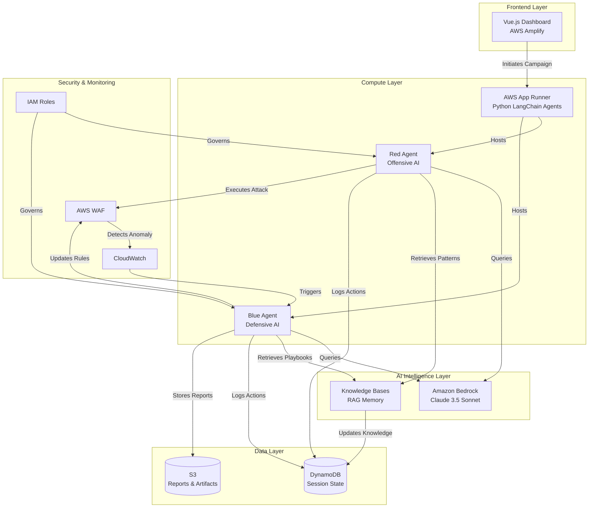
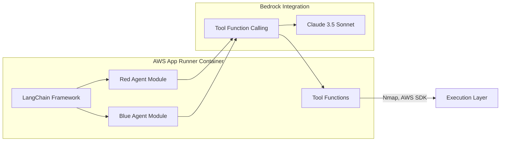
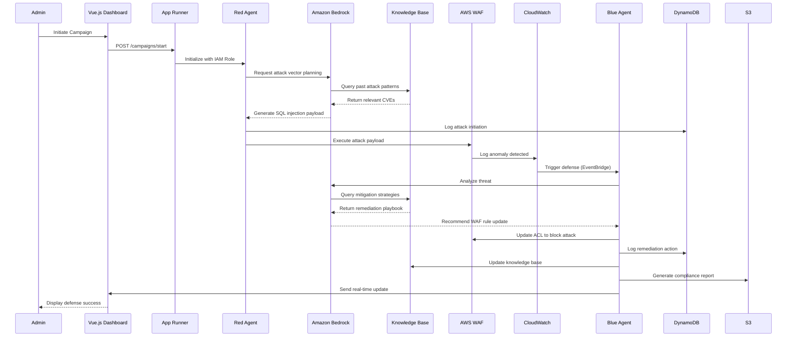
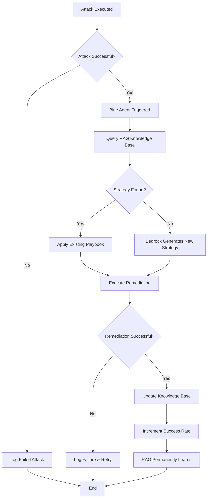
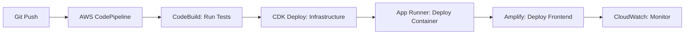
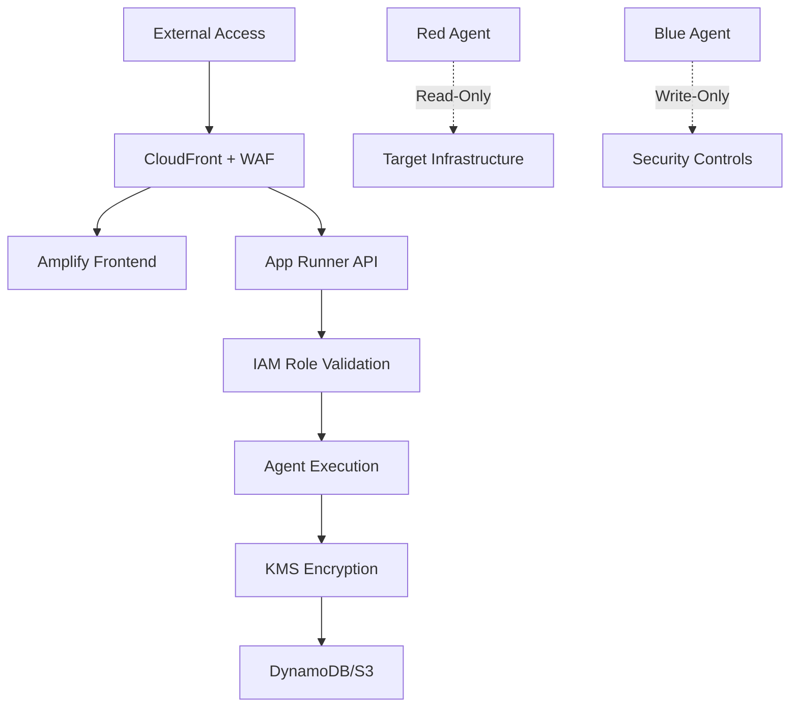

# Design Document: Sentinel AI
## Autonomous Purple Teaming Platform

**Project Name:** Sentinel AI  
**Tagline:** "Attack to Defend. Autonomously."  
**Version:** 1.0  
**Date:** February 15, 2026

---

## 1. Executive Summary

Sentinel AI is an autonomous purple teaming platform that deploys dual-model AI agents (Red Team offensive + Blue Team defensive) to validate vulnerabilities through active exploitation and auto-remediation. Built on AWS serverless architecture, it eliminates the reactive nature of traditional cybersecurity tools by continuously learning and adapting to new threats.

### 1.1 Key Differentiators
- **Active Validation:** Unlike GuardDuty's passive monitoring, Sentinel AI actively exploits vulnerabilities to validate real risk.
- **Auto-Remediation:** Blue Agent automatically patches infrastructure without human intervention.
- **Continuous Learning:** RAG-powered knowledge base evolves with each attack-defense cycle.
- **Zero-Ops:** Fully serverless architecture with scale-to-zero capabilities.
- **Cost-Effective:** Sub-$40 per customer monthly operating cost.

---

## 2. System Architecture

### 2.1 High-Level Architecture



### 2.2 Component Architecture



---

## 3. Detailed Component Design

### 3.1 Frontend Layer

#### 3.1.1 Vue.js Dashboard (AWS Amplify)
**Purpose:** Provide real-time visualization of purple teaming campaigns.

**Key Features:**
- Campaign initiation interface
- Real-time agent status monitoring
- Attack vector visualization
- Defense action timeline
- Compliance report viewer
- Historical campaign analytics

**Technology Stack:**
- Vue.js 3 with Composition API
- AWS Amplify Hosting
- AWS Amplify Auth (Cognito integration)
- WebSocket for real-time updates

**Deployment:**
- Hosted on AWS Amplify with CI/CD from Git repository
- CloudFront CDN for global distribution
- Custom domain with SSL/TLS

### 3.2 Compute Layer

#### 3.2.1 AWS App Runner
**Purpose:** Host Python-based LangChain AI agents in Docker containers.

**Configuration:**
- **Runtime:** Python 3.11
- **Memory:** 2 GB
- **CPU:** 1 vCPU
- **Auto-scaling:** 1-10 instances based on concurrent campaigns
- **Scale-to-zero:** Enabled (scales to 0 after 5 minutes of inactivity)

**Docker Container:**
```dockerfile
FROM python:3.11-slim
WORKDIR /app
COPY requirements.txt .
RUN pip install --no-cache-dir -r requirements.txt
COPY . .
CMD ["python", "main.py"]
```

**Dependencies:**
- langchain
- boto3 (AWS SDK)
- langchain-aws (Bedrock integration)
- fastapi (API endpoints)
- uvicorn (ASGI server)

#### 3.2.2 Red Agent (Offensive AI)
**Purpose:** Formulate and execute attack payloads to validate vulnerabilities.

**Capabilities:**
- SQL injection payload generation
- XSS attack simulation
- Privilege escalation testing
- API abuse detection
- Network scanning (Nmap integration)

**LangChain Tools:**
```python
@tool
def execute_sql_injection(target_url: str, payload: str) -> dict:
    """Execute SQL injection attack against target URL"""
    # Implementation with safety checks
    pass

@tool
def scan_network(target_ip: str) -> dict:
    """Perform Nmap scan on target infrastructure"""
    # Implementation
    pass

@tool
def test_privilege_escalation(iam_role: str) -> dict:
    """Test IAM privilege escalation vectors"""
    # Implementation
    pass
```

**IAM Permissions:**
- Read-only access to target infrastructure
- Write access to DynamoDB (logging only)
- No production data access

#### 3.2.3 Blue Agent (Defensive AI)
**Purpose:** Detect attacks and auto-remediate vulnerabilities.

**Capabilities:**
- Anomaly detection via CloudWatch integration
- RAG-powered mitigation strategy retrieval
- Automated WAF rule updates
- Security group modification
- IAM policy restriction

**LangChain Tools:**
```python
@tool
def update_waf_acl(rule_id: str, action: str) -> dict:
    """Update AWS WAF ACL rules to block attack vectors"""
    # Implementation using boto3
    pass

@tool
def modify_security_group(group_id: str, rule: dict) -> dict:
    """Modify security group rules to restrict access"""
    # Implementation
    pass

@tool
def query_knowledge_base(attack_vector: str) -> dict:
    """Query RAG knowledge base for mitigation strategies"""
    # Implementation using Bedrock Knowledge Bases API
    pass
```

**IAM Permissions:**
- Write access to WAF, Security Groups, IAM policies
- Read access to CloudWatch, GuardDuty
- Write access to DynamoDB and S3

### 3.3 AI Intelligence Layer

#### 3.3.1 Amazon Bedrock (Claude 3.5 Sonnet)
**Purpose:** Provide reasoning engine for both Red and Blue agents.

**Model Configuration:**
- **Model ID:** anthropic.claude-3-5-sonnet-20241022-v2:0
- **Temperature:** 0.7 (balanced creativity and consistency)
- **Max Tokens:** 4096
- **Top P:** 0.9

**Usage Patterns:**
- Red Agent: Attack vector planning and payload generation
- Blue Agent: Threat analysis and mitigation strategy selection

**Cost Optimization:**
- Response caching for repeated queries
- Token usage tracking per campaign
- Batch processing for non-urgent operations

#### 3.3.2 Knowledge Bases for Amazon Bedrock (RAG)
**Purpose:** Store and retrieve attack patterns, CVEs, and mitigation playbooks.

**Data Sources:**
- CVE database (NIST NVD)
- MITRE ATT&CK framework
- Historical attack logs from DynamoDB
- Successful remediation playbooks

**Vector Store:**
- Amazon OpenSearch Serverless
- Embedding model: amazon.titan-embed-text-v1
- Chunk size: 512 tokens
- Overlap: 50 tokens

**Knowledge Base Structure:**
```json
{
  "attack_vector": "SQL Injection",
  "cve_id": "CVE-2024-XXXX",
  "severity": "HIGH",
  "mitigation_strategy": {
    "action": "update_waf_acl",
    "parameters": {
      "rule_type": "SQLi_RULE",
      "action": "BLOCK"
    }
  },
  "success_rate": 0.95,
  "last_updated": "2026-02-15T10:30:00Z"
}
```

### 3.4 Data Layer

#### 3.4.1 Amazon DynamoDB
**Purpose:** Store session states, audit logs, and attack outcomes.

**Table Design:**

**Table 1: CampaignSessions**
```
Partition Key: campaign_id (String)
Sort Key: timestamp (Number)
Attributes:
  - status (String): ACTIVE | COMPLETED | FAILED
  - red_agent_actions (List)
  - blue_agent_actions (List)
  - attack_vectors (List)
  - remediation_count (Number)
  - cost_usd (Number)
```

**Table 2: AuditLogs**
```
Partition Key: session_id (String)
Sort Key: event_timestamp (Number)
Attributes:
  - agent_type (String): RED | BLUE
  - action (String)
  - target (String)
  - outcome (String)
  - iam_role (String)
```

**Table 3: KnowledgeEvolution**
```
Partition Key: attack_vector_id (String)
Sort Key: version (Number)
Attributes:
  - attack_signature (String)
  - mitigation_playbook (Map)
  - success_rate (Number)
  - last_seen (Number)
```

**Capacity Mode:** On-Demand (pay-per-request)
**Encryption:** AWS KMS with customer-managed key
**Backup:** Point-in-time recovery enabled

#### 3.4.2 Amazon S3
**Purpose:** Store compliance reports and attack artifacts.

**Bucket Structure:**
```
sentinel-ai-artifacts/
├── compliance-reports/
│   ├── soc2/
│   │   └── campaign-{id}-soc2-{date}.pdf
│   └── iso27001/
│       └── campaign-{id}-iso27001-{date}.pdf
├── attack-artifacts/
│   └── campaign-{id}/
│       ├── payloads.json
│       └── network-scans.txt
└── knowledge-base-exports/
    └── kb-snapshot-{date}.json
```

**Configuration:**
- Versioning: Enabled
- Encryption: SSE-S3
- Lifecycle Policy: Move to Glacier after 90 days
- Public Access: Blocked

### 3.5 Security & Monitoring Layer

#### 3.5.1 AWS WAF
**Purpose:** Detect and block attack vectors from Red Agent.

**Rule Groups:**
- AWS Managed Rules (Core Rule Set)
- SQL Injection protection
- XSS protection
- Rate limiting (100 requests per 5 minutes)

**Integration:**
- CloudWatch Logs for anomaly detection
- Blue Agent API for rule updates

#### 3.5.2 Amazon CloudWatch
**Purpose:** Monitor agent actions and trigger Blue Agent on anomalies.

**Metrics:**
- Red Agent attack success rate
- Blue Agent response time
- WAF block count
- Bedrock token usage
- App Runner CPU/Memory utilization

**Alarms:**
- Blue Agent response time > 30 seconds
- Bedrock cost > $10/day
- DynamoDB throttling events

**Log Groups:**
- /aws/apprunner/sentinel-ai
- /aws/waf/sentinel-ai
- /aws/lambda/blue-agent-trigger

#### 3.5.3 IAM Role Separation
**Red Agent Role:**
```json
{
  "Version": "2012-10-17",
  "Statement": [
    {
      "Effect": "Allow",
      "Action": [
        "ec2:Describe*",
        "waf:Get*",
        "dynamodb:PutItem"
      ],
      "Resource": "*"
    },
    {
      "Effect": "Deny",
      "Action": [
        "waf:UpdateWebACL",
        "ec2:Modify*",
        "iam:*"
      ],
      "Resource": "*"
    }
  ]
}
```

**Blue Agent Role:**
```json
{
  "Version": "2012-10-17",
  "Statement": [
    {
      "Effect": "Allow",
      "Action": [
        "waf:UpdateWebACL",
        "ec2:ModifySecurityGroupRules",
        "iam:UpdateAssumeRolePolicy",
        "dynamodb:PutItem",
        "s3:PutObject"
      ],
      "Resource": "*"
    }
  ]
}
```

---

## 4. Data Flow Diagrams

### 4.1 Purple Teaming Loop Flow



### 4.2 Knowledge Base Evolution Flow



---

## 5. Technology Stack Summary

| Layer | Technology | Purpose |
|-------|-----------|---------|
| Frontend | Vue.js 3 | Dashboard UI |
| Hosting | AWS Amplify | Frontend hosting & CI/CD |
| Compute | AWS App Runner | Container hosting |
| AI Engine | Amazon Bedrock (Claude 3.5 Sonnet) | Agent reasoning |
| Agent Framework | Python LangChain | Tool orchestration |
| Vector Memory | Knowledge Bases for Amazon Bedrock | RAG implementation |
| Database | Amazon DynamoDB | Session state & logs |
| Storage | Amazon S3 | Reports & artifacts |
| Security | AWS WAF | Attack detection |
| Monitoring | Amazon CloudWatch | Metrics & alarms |
| Identity | AWS IAM | Role separation |
| Embedding | Amazon Titan Embed | Vector generation |
| Search | OpenSearch Serverless | Vector store |

---

## 6. Deployment Architecture

### 6.1 Infrastructure as Code (IaC)

**Tool:** AWS CDK (Python)

**Stack Structure:**
```
sentinel-ai-cdk/
├── app.py
├── stacks/
│   ├── frontend_stack.py (Amplify)
│   ├── compute_stack.py (App Runner)
│   ├── ai_stack.py (Bedrock, Knowledge Bases)
│   ├── data_stack.py (DynamoDB, S3)
│   └── security_stack.py (WAF, IAM)
└── requirements.txt
```

### 6.2 Deployment Pipeline



### 6.3 Environment Strategy

**Environments:**
1. **Dev:** Single App Runner instance, minimal Bedrock usage
2. **Staging:** Production-like setup with synthetic campaigns
3. **Production:** Auto-scaling enabled, full monitoring

---

## 7. Cost Analysis

### 7.1 Cost Breakdown (5 Enterprise Customers)

| Service | Usage | Monthly Cost |
|---------|-------|--------------|
| AWS App Runner | 100 hours active (scale-to-zero) | $25 |
| Amazon Bedrock | 500K tokens/month | $50 |
| Knowledge Bases | 10K vectors, 1K queries | $15 |
| DynamoDB | 1M read/write units | $10 |
| S3 | 10 GB storage, 1K requests | $5 |
| CloudWatch | 10 GB logs, 50 metrics | $10 |
| AWS WAF | 1M requests | $20 |
| Amplify | 5 GB bandwidth | $5 |
| **Total** | | **$140** |
| **Per Customer** | | **$28** |

### 7.2 MVP Cost (Single Customer)

| Service | Usage | Monthly Cost |
|---------|-------|--------------|
| AWS App Runner | 20 hours (Free Tier) | $0 |
| Amazon Bedrock | 100K tokens | $10 |
| Knowledge Bases | 1K vectors | $3 |
| DynamoDB | 100K units (Free Tier) | $0 |
| S3 | 1 GB (Free Tier) | $0 |
| CloudWatch | 5 GB logs (Free Tier) | $0 |
| AWS WAF | 100K requests | $5 |
| Amplify | 1 GB (Free Tier) | $0 |
| **Total** | | **$18** |

---

## 8. Security Architecture

### 8.1 Defense in Depth



### 8.2 Threat Model

| Threat | Mitigation |
|--------|-----------|
| Red Agent privilege escalation | Strict IAM deny policies, no production access |
| Blue Agent over-remediation | Human approval for high-risk changes (optional) |
| Knowledge Base poisoning | Immutable audit logs, version control |
| Bedrock prompt injection | Input validation, sanitization |
| Cost explosion | CloudWatch billing alarms, token limits |

---

## 9. Compliance Mapping

### 9.1 SOC 2 Type II Controls

| Control | Implementation |
|---------|---------------|
| CC6.1 (Logical Access) | IAM role separation, MFA for admins |
| CC6.6 (Encryption) | KMS for data at rest, TLS for transit |
| CC7.2 (Monitoring) | CloudWatch logs, DynamoDB audit trail |

### 9.2 ISO 27001 Controls

| Control | Implementation |
|---------|---------------|
| A.9.2 (User Access) | Cognito authentication, IAM policies |
| A.12.4 (Logging) | Immutable DynamoDB logs, CloudWatch |
| A.18.1 (Compliance) | Auto-generated audit reports |

---

## 10. Future Enhancements

### 10.1 Phase 2 Features
- Multi-region deployment for global customers
- Integration with third-party SIEM tools
- Custom attack vector plugins
- Advanced ML-based anomaly detection

### 10.2 Scalability Roadmap
- Support for 100+ concurrent campaigns
- Multi-cloud support (Azure, GCP)
- Enterprise SSO integration (SAML, OIDC)

---

**Document Control:**
- **Author:** Kiro AI Assistant
- **Reviewed By:** [Abhishek Joshi]
- **Approved By:** [Abhishek Joshi]
- **Next Review Date:** [30-02-2026]
